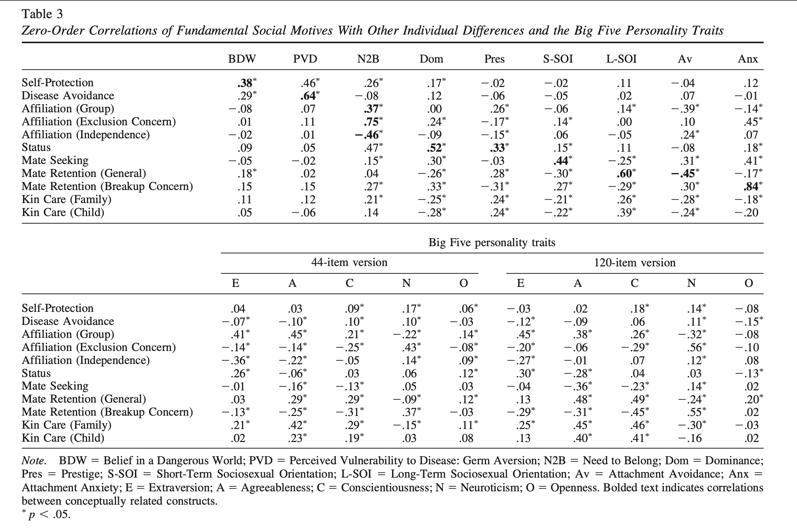
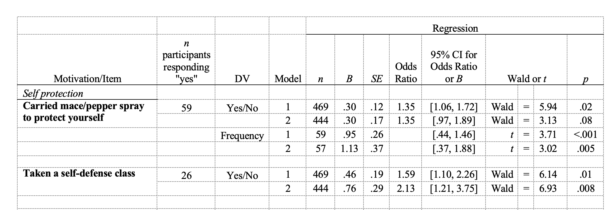
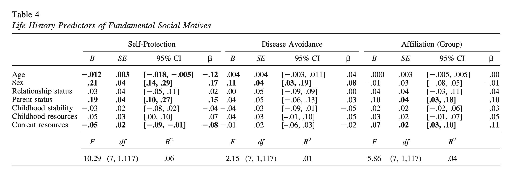

```{r setup, include=FALSE}
knitr::opts_chunk$set(echo = TRUE)
```

## Libraries

## Data

## Analyses

### Related individual differences.

Scores for each fundamental social motive scale are averages of responses to scale items.

- Fundamental Social Motives Inventory: create 11 subscale scores

  1)  Self-Protection
  2)  Disease Avoidance
  3)  Affiliation (Group)
  4)  Affiliation (Exclusion Concern)
  5)  Affiliation (Independence)
  6)  Status
  7)  Mate Seeking
  8)  Mate Retention (General)
  9)  Mate Retention (Breakup Concern)
  10) Kin Care (Family)
  11) Kin Care (Child)

- Individual differences scales

  - Belief in a Dangerous World
  - Perceived Vulnerability to Disease: Germ Aversion
  - Need to Belong
  - Dominance
  - Prestige
  - Short-Term Sociosexual Orientation
  - Long-Term Sociosexual Orientation
  - Attachment Avoidance
  - Attachment Anxiety

- Big Five Personality (44 item version)

  - Extraversion
  - Agreeableness
  - Conscientiousness
  - Neuroticism
  - Openness

Correlation coefficients were computed between the individual difference scales and the fundamental social motives.



### Behaviors

#### Life data.

We first analyzed all items as binary outcomes representing whether the participant had had the experience/done the behavior in the past year (0 no, 1 yes). The items ranged widely in what percentage of the sample had had the experience in the past year, with the least common being having served in the military (1.8% of the sample) and skydiving (2.9%) and the most common being having cooked a meal at home (89.7% of the sample) and having used social networking websites (83.0%), with a mean percentage across items of 30% having had the experience in the past year.

In the following sections, we report the odds ratio (OR) for each logistic regression analysis predicting each outcome. For those items that were responded to on a continuous scale, we also analyzed the data within the subsample of people who had engaged in the behavior in the past year, to examine the extent to which they engaged in that behavior. In general, analyses on the continuous measures within the group who had engaged in the behavior in the last year produced few significant results, though we note some exceptions below.

For both life data and people mentioned from the night before the study, we also conducted logistic regressions that controlled simultaneously for the other fundamental social motives, the Big Five, and all life history variables. On the whole, the patterns, magnitude, and significance of the results tended to remain even when controlling for these factors (see Table S3).

For each life question, calculate:

1.  the number of times people said yes

2.  For those people, then create these models:

    1.  Behavior \~ Subscale that matches the motive

    2.  Behavior \~ Subscale match + other 10 motives + Big five + demographics

Model 1 includes only the listed motive as a predictor. Model 2 controls for all other motives (but not mate retention motives and kin care child, with one exception: For those analyses in which one of the two mate retention motives was the focal predictor, the other mate retention motive was included); the Big Five; age, sex, relationship status (single, in a relationship), parent status, childhood stability, childhood resources, and current resources. \*this regression includes kin care child as a predictor



#### Life history variables.

To examine the extent to which life history variables predicted each fundamental social motive, we conducted regression analyses. For each motive, we simultaneously entered age, sex (men 1, women 1), relationship status (single 1, in relationship 1), parent status (nonparent 1, parent 1), childhood stability, childhood resources, and current resources as predictors. Results are highlighted in the next sections, with full results reported in Table 4.


